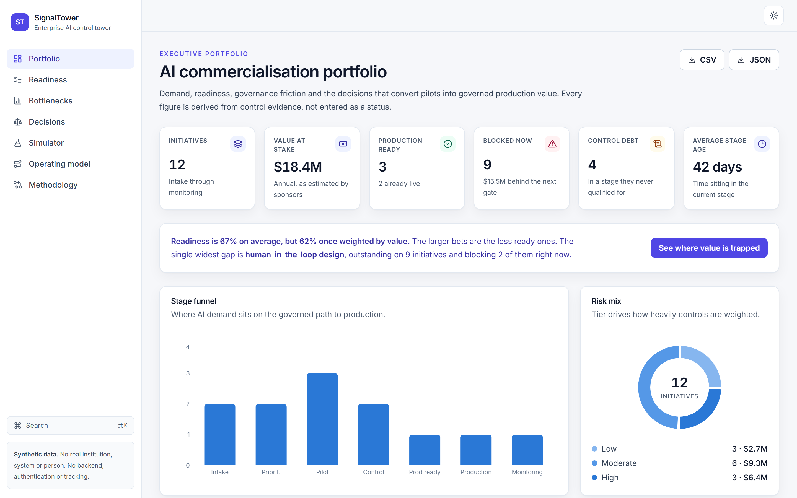
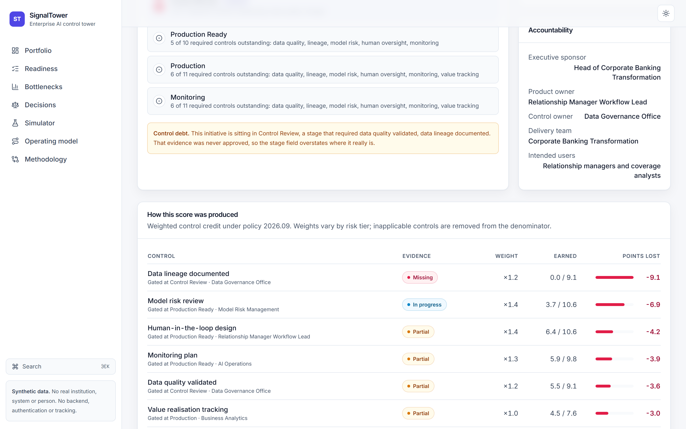
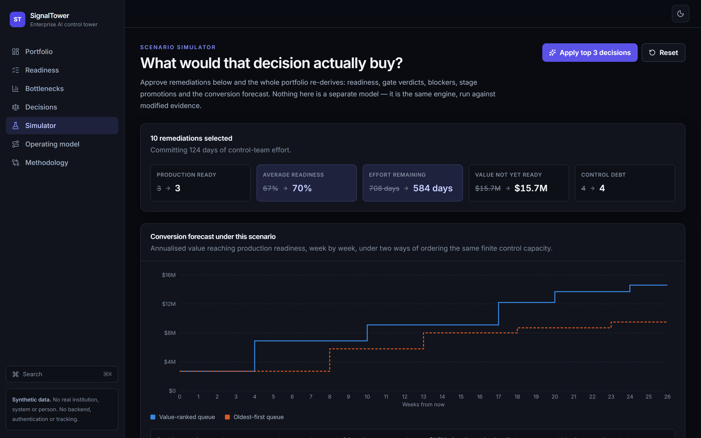
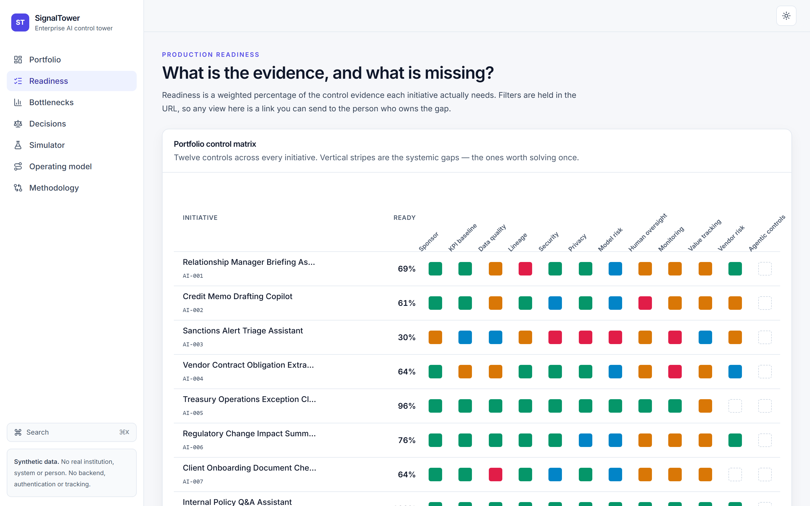
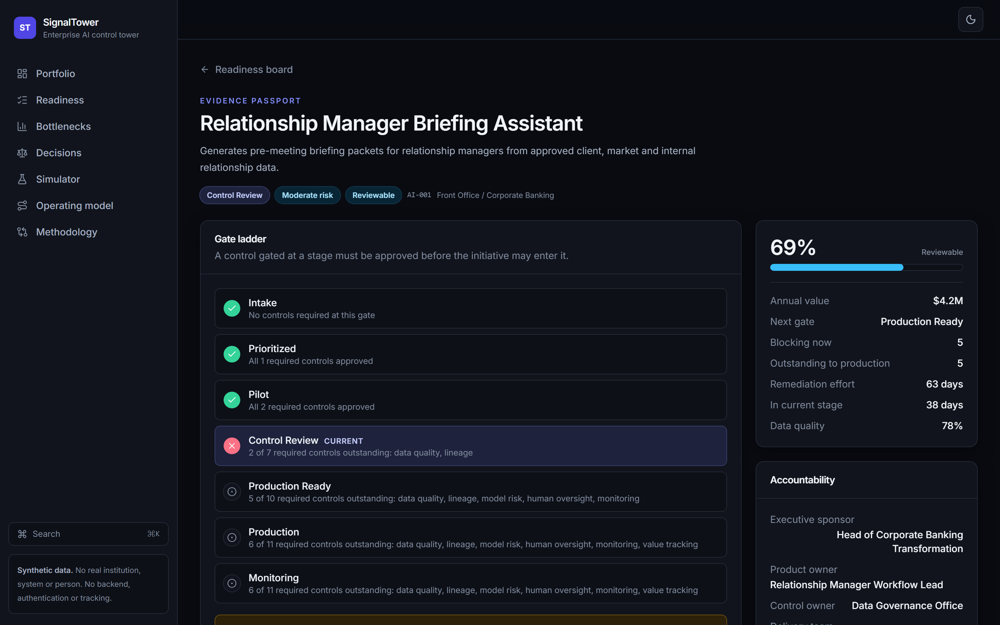
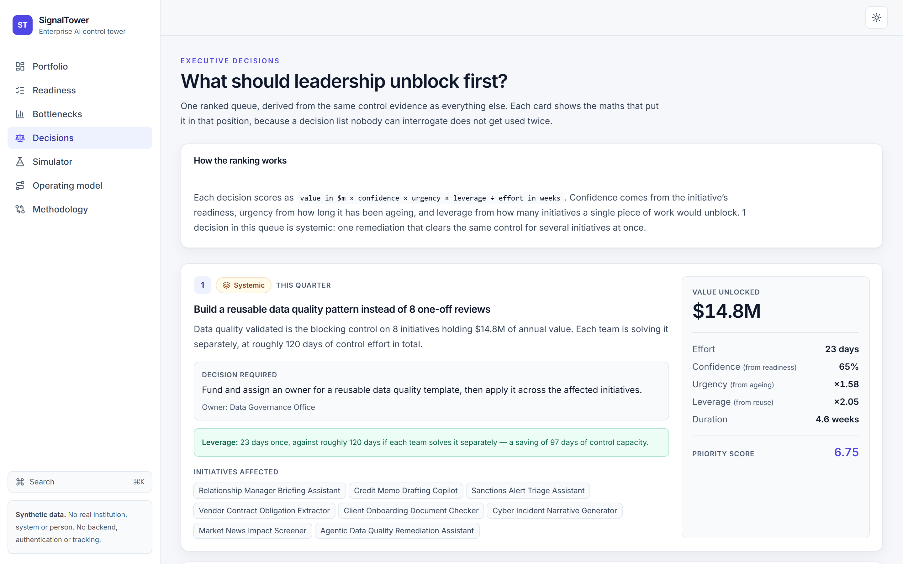
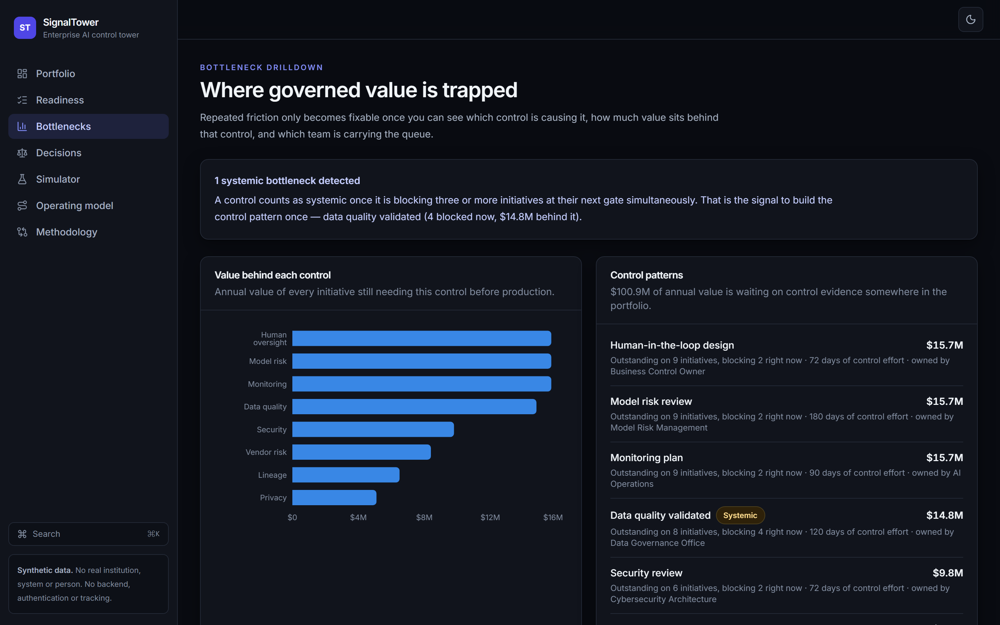

# SignalTower AI

**A control tower for enterprise AI commercialisation, built on a decision engine rather than a dashboard.**

[Live demo](https://signaltower-ai.vercel.app) · [Architecture](docs/architecture.md) · [Methodology](https://signaltower-ai.vercel.app/methodology) · [Case study](docs/case-study.md)

> **Synthetic data only.** No real institution, system, person or metric appears anywhere in this
> repository. There is no backend, no API, no authentication, no database and no tracking. The
> scenarios are composites of publicly discussed enterprise AI adoption patterns in regulated
> industries.

---



## The problem it models

Large regulated enterprises rarely stall on the model. They stall on the _evidence_ — the lineage
nobody owns, the reviewer accountability nobody wrote down, the monitoring plan that does not exist
yet. Twelve initiatives each negotiate that separately, and the same control blocks four of them at
once without anyone noticing it is one problem rather than four.

SignalTower makes that visible and then acts on it: which initiatives can move, which are stuck,
what specifically is stopping them, and which single decision would release the most value soonest.

## What makes this more than a dashboard

The obvious way to build this is a file of use cases with a `readinessScore: 71` on each, rendered
into charts. That is a slide deck in React: the numbers are assertions, nothing can be interrogated,
and nothing recomputes.

**This inverts the data model.** [`src/data/portfolio.ts`](src/data/portfolio.ts) records only
_observable evidence_ — the state of each control artifact, who owns it, how long it has sat there.
Every conclusion is derived by a pure, tested engine in [`src/engine`](src/engine):

| Stored as evidence                         | Derived by the engine                               |
| ------------------------------------------ | --------------------------------------------------- |
| Control artifact state, owner, age         | Readiness score, band, and per-control contribution |
| Stage, risk tier, sponsor-estimated value  | Stage-gate verdicts and blockers                    |
| Data classification, model characteristics | Systemic control patterns across the portfolio      |
| A factual note on what exists today        | Ranked decision queue and conversion forecast       |

Three things follow from that inversion, and they are the point of the project:

**1. Every number can be taken apart.** The Evidence Passport shows exactly how a score was
produced — each control's weight for that risk tier, the credit its evidence earned, and the score
points it is currently costing. A readiness number nobody can challenge is a number nobody trusts.



**2. The interface can ask "what if".** The simulator ticks remediations onto a copy of the
portfolio and re-derives everything through the same engine — readiness, gate verdicts, stage
promotions, the forecast. There is no second model to fall out of step with the first.



**3. Patterns emerge that no hand-authored dataset would contain.** Two examples the engine finds on
its own:

- **Control debt.** Four initiatives are sitting in a stage whose own gate they never cleared. A
  status field says they arrived; nothing re-checks whether they qualified.
- **Systemic blockers.** When one control blocks three or more initiatives _at the same time_, the
  engine stops proposing three reviews and proposes one reusable pattern instead — costed against
  what doing it separately would have taken.

## Interface

|                                                                                                           |                                                                                          |
| --------------------------------------------------------------------------------------------------------- | ---------------------------------------------------------------------------------------- |
|                                  |                      |
| **Control matrix** — twelve controls across every initiative. The vertical stripes are the systemic gaps. | **Evidence passport** — every initiative has one, with its gate ladder and control debt. |
|                                               |                                  |
| **Decisions** — ranked by value, confidence, urgency and leverage, with the maths shown.                  | **Bottlenecks** — where value is trapped, and which review function is the constraint.   |

Also included: full light and dark themes with a system option, a `⌘K` command palette,
URL-synced filters so any board view is a shareable link, sortable tables, CSV/JSON export, and a
[Methodology page](https://signaltower-ai.vercel.app/methodology) generated from the live policy
object so it cannot drift from the scoring.

## Engineering

```
src/
  engine/          Pure domain logic. No React, no I/O, no clock.
    types.ts       Domain model — evidence, never conclusions
    policy.ts      The scoring policy as executable data
    readiness.ts   Weighted scoring with per-control explainability
    gates.ts       Stage gates, control debt
    blockers.ts    Derived blockers and portfolio patterns
    decisions.ts   Decision ranking, including systemic detection
    forecast.ts    Deterministic capacity simulation
    scenario.ts    What-if modelling
    portfolio.ts   Aggregates
  components/      Presentational, split ui/ and domain/
  pages/           One per route, all code-split
  hooks/  lib/     Theme, URL state, formatting, export
```

The engine is dependency-free and deterministic: every export is a function of its arguments. That
is what makes it testable, and it is why the UI is a thin renderer over derived state rather than a
place where business rules accumulate.

### Verification

| Check           | Result                                                                             |
| --------------- | ---------------------------------------------------------------------------------- |
| Unit tests      | **307 passing**                                                                    |
| Engine coverage | **98.8% statements · 89.5% branches · 100% functions · 99.5% lines** (thresholds enforced in CI) |
| End-to-end      | **56 passing** across desktop and mobile viewports                                 |
| Accessibility   | **0 violations** — axe-core, WCAG 2.1 AA, all 9 routes in both themes              |
| Types           | `strict`, `noUnusedLocals`, `noUnusedParameters`, `erasableSyntaxOnly`             |
| Lint            | ESLint clean, including `jsx-a11y`                                                 |
| Dependencies    | **0 npm vulnerabilities**                                                          |
| Initial JS      | **293 kB (92 kB gzip)** — charts load on demand                                    |

Tests are built from an explicit factory rather than the shipped fixture, so they assert engine
behaviour instead of demo content. A separate [fixture-integrity suite](src/data/__tests__/fixture.test.ts)
holds the demo data to its invariants — the sharpest being that a control is marked `not_applicable`
_exactly_ when the policy says it does not apply, which catches an initiative whose model flags and
evidence have drifted apart.

The screenshots above are regenerated from the production build by
[`npm run screenshots`](scripts/capture-screenshots.ts). Hand-captured images go stale the moment
the interface moves, and a portfolio piece whose pictures disagree with the deployed app is worse
than one with no pictures at all.

## Running it

```bash
npm install
npm run dev
```

```bash
npm run verify        # typecheck, lint, unit tests, build
npm run test:coverage # unit tests with enforced coverage thresholds
npm run test:e2e      # end-to-end and accessibility (needs: npx playwright install chromium)
npm run inspect       # print what the engine derives from the fixture
npm run screenshots   # regenerate docs/screenshots from the production build
```

Node 22+. The build output in `dist/` is a static bundle deployable to any static host.

## Honest limitations

Stated here rather than left for a reader to find:

- **The data is synthetic.** Readiness distributions, effort estimates and values are plausible
  composites, not measurements. Nothing here validates the policy against real conversion outcomes.
- **The forecast is a model, not a prediction.** It is a deterministic queue simulation whose job is
  to make the cost of poor sequencing visible. Its assumptions — including the one that most
  favours the ranked queue — are listed in full on the Methodology page.
- **Readiness measures evidence completeness, not quality.** An initiative can score 100% and still
  be a bad idea. The engine deliberately has no opinion about whether a use case is worth doing.
- **Confidence is a heuristic**, derived from readiness as a proxy. There is no historical
  conversion data to fit it to, because the portfolio is not real.
- **The control catalogue is a composite**, not any specific regulatory framework.

## Licence

MIT. See [LICENSE](LICENSE).
